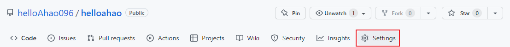
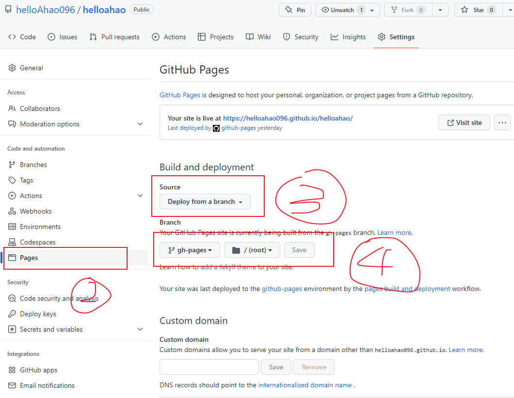
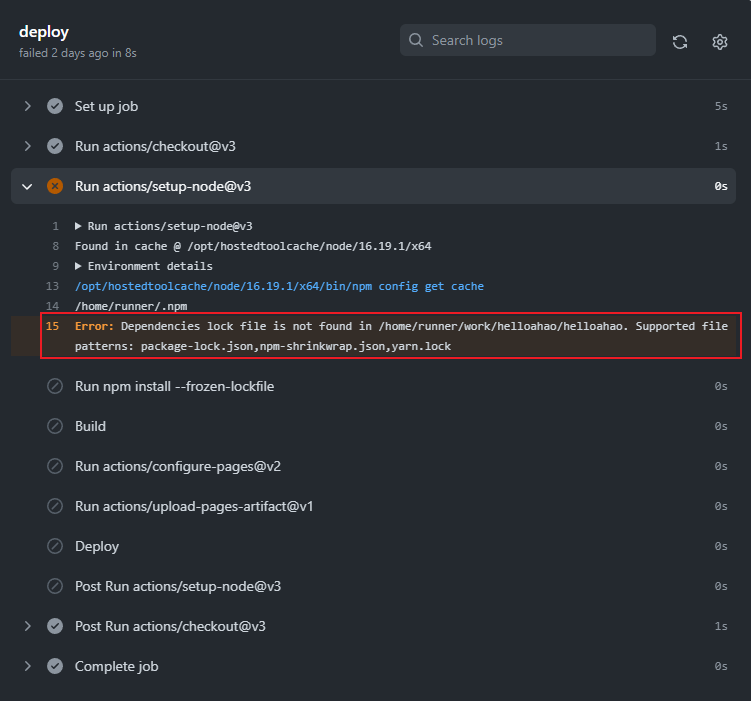
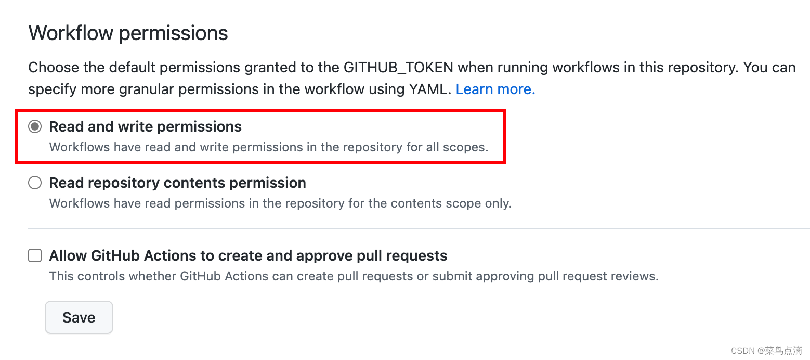

# GitHub Action基本介绍

## 文档

- GitHub Action官方文档（英文）

文档地址：https://docs.github.com/zh/actions/quickstart

- 阮一峰GitHub Action入门教程（中文）

文档地址：https://www.ruanyifeng.com/blog/2019/09/getting-started-with-github-actions.html

---

***本网站使用Github Action一键部署，将其为例，以下介绍详细配置***

## 部署案例
1. 部署配置文件：

   （本博客使用actions-gh-pages配置文件/任选其一即可）

    在博客项目代码推送后一键部署并且创建gh-pages分支,无需手动创建gh-pages分支

   - vitepress配置文件：https://vitepress.dev/guide/deploy#github-pages
   
   十分不好用，不知道是不是我不会用的原因，但是个是对小白来说，该文档就只有最基础的配置 
   
   - actions-gh-pages配置文件(github开源项目)：https://github.com/peaceiris/actions-gh-pages
2. 在项目根目录创建deploy.yml部署文件

   需要同步到git中，推送至代码仓库
```yaml
# .github > workflows > deploy.yml
name: Deploy

on:
   push:
      branches:
         - master

jobs:
   deploy:
      runs-on: ubuntu-latest
      steps:
         - uses: actions/checkout@v3
           with:
              fetch-depth: 0
         - uses: actions/setup-node@v3
           with:
              node-version: 16
              cache: npm
         - run: npm install --frozen-lockfile

         - name: Build
           run: npm run docs:build

         - name: Deploy
            # 将构建产物 commit 到一个分支上，用于发布静态站点资源
            # https://github.com/peaceiris/actions-gh-pages
            #不要将peaceiris改为自己的仓库名，我单纯的以为这个需要改成自己的仓库名，部署上去就build失败了，需引用该仓库的配置
           uses: peaceiris/actions-gh-pages@v3
           with:
              # Github 会在 workflow 中自动生成 GIHUBT_TOKEN，用于认证 workflow 的运行
              github_token: ${{ secrets.GITHUB_TOKEN }}
              # 静态资源目录设置
              publish_dir: docs/.vitepress/dist
              # 默认发布到 gh-pages 分支上，可以指定特定的发布分支（不能选拉取代码的分支）
              publish_branch: gh-pages
              full_commit_message: ${{ github.event.head_commit.message }}
```
3. 将博客项目推送至创建好的仓库

   不需要像网上一样，创建``xxx.github.io``设为仓库名，直接创建项目，会直接将仓库名设置为二级域名

   例如本博客，仓库名为``helloahao``，则子域名自动生成为``helloahao.github.io``

   - 需要在repo setting中详细配置
   1. 选择代码仓库的Settings
      
   2. 选择pages
   3. 来源选择为一个分支
   4. 选择由action生成的gh-pages分支
      
---
## 踩坑总结
搭建博客全部踩坑经历，血泪史记录一下
1. ``package-lock.json``记得上传到代码仓库，不然github action无法构建项目
   
   平时做项目的时候，只会关注``package.json``，下意识的以为``package-lock.json``是不需要的，但是github action需要这个文件构建项目
   
2. 生成的gh-pages分支要开读写权限，不然生成的代码push不上去

   参考：https://blog.csdn.net/weixin_42282187/article/details/124766382
   ```
   Error: Action failed with "The process '/usr/bin/git' failed with exit code 128"
   The requested URL returned error: 403
   ```
   解决方案：
   转到存储库Setting
   选择Actions>>>General
   在"工作流权限(Workflow permissions)"中，选择Read and write permissions
   
3. 有的教程在deploy.yaml中写 ``npm run docs:build``，不用run关键词，直接跑，我一开始还以为yaml的run字段会补全该功能，直接报错
``[error]Process completed with exit code 1.``
4. 网上搜到的什么deploy.sh根本不好用，我尝试过配置shell脚本，完全不好用，github action直接一步到位，参考本博客即可